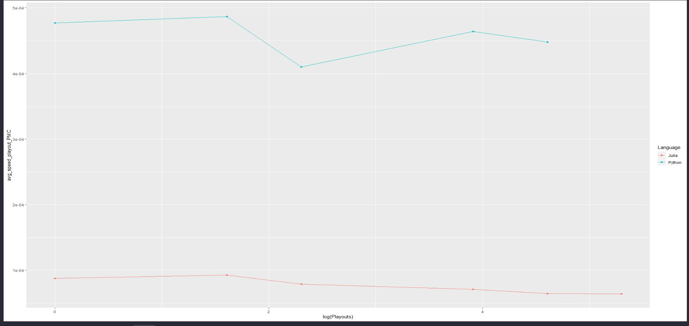

<!-- TABLE OF CONTENTS -->
## Table of Contents

* [Requirements](#requirements)
* [Chosen Project](#chosen-project)
* [Project Files](#project-files)
* [User Interface](#user-interface)
* [Python Library](#python-library)
  * [My Python Code](#my-python)
* [Chosen Language](#chosen-language)
  * [Speed Comparison](#speed-comparison)
* [Models](#models)
  * [Pure Monte-Carlo Tree Search](#pmcts)
  * [Monte-Carlo Tree Search With Tactics](#mcts-with-tactics)
  * [Alpha Beta Pruning](#alpha-beta)
  * [Heuristics](#heuristics)
  * [AI vs. AI comparison](#ai-vs-ai)

## Requirements

These can be found in `requirements.txt`
The code was built using Python 3.8.5 and Julia 1.5.0

Be sure you are running both 64 bit versions as Python tends to install 32 bit
by default and this will cause errors.

Set up venv:

`$python -m venv venv`

In Windows:

`$ venv\Scripts\activate.bat`

In Linux/MacOs:

`$ source venv/bin/activate`

Run:

``` 
$ pip install -r requirements.txt
$ juliaSetup.py
```
Set up Julia libraries:

Run:

```
$ Julia
$ include("setup.jl")
```

<!-- CHOSEN PROJECT -->
## Chosen Project

### Reversi with Monte-Carlo Tree Search

This is a program to play Reversi(Othello) against the computer. The AI player
uses variations on Monte-Carlo Tree Search(MCTS), with varying heuristics to
allow the player to play at different difficulty levels.

<!-- PROJECT FILES -->
## Project Files

* `alphaBetajl.jl` : Julia alpha beta implementation
* `chooseMovejl.jl` : MCTS Julia implementation
* `dot.jl` : test code for Julia dot product
* `getplays.jl` : test code for get plays written in Julia
* `heuristics.jl` : heuristics implemented in Julia
* `juliaSetup.jl` : script to set up PyJulia requirements
* `MCTS.rmd` : R code for plotting
* `move.jl` : test code for move written in Julia
* `requirements.txt` : Pyhton requirements
* `results.*` : The raw data for the timing runs
* `reversi.py` : the Python Code to run the reversi game
* `reversiAI.py` : AI vs AI in python
* `reversijl.py` : implementation in Julia
* `reversijlAI.py` : Julia implemented AI vs AI
* `runTest.sh` : Shell script to iterate over all number of playouts/depts and 
all combinations of models
* `setup.jl` :Julia requirements
* `test.py` : testing the dot products in python and Julia
* `testing.py` : test all of the Julia functions
* `utils.jl` : helper functions for AI models
* `valid.jl` : test code for valid written in Julia

<!-- USER INTERFACE -->
## User Interface
<p align="center">

</p>

To begin select the level of difficulty. To learn more about difficulty levels
see [Models](#models) 

The player is white, and will always go first.

The score is tallied in the bottom corners of the screen, black on the right and
white on the left.

The game will play until both players can no longer play a token and both need to
pass. The program will tell you that "The game is done!" and the final scores
can, again, be found at the bottom of the screen. The higher score is the winner!

You may play again by pressing the blue reverse arrow and close the screen by
pressing the red 'X'.

<p align="center">

</p>

<!-- PYTHON LIBRARY -->
## Python Library

The GUI for this code was forked from this git repository: 
https://github.com/johnafish/othello.git

### My Python

`PyJulia` has been used in order to interface the Julia environment though python.
For more info about the Julia language see [Chosen Language](#chosen-langauge).
In order to be sure that the code is correctly dropping to the Julia environment
rather than simply leveraging Julia code within the python environment a test
was run. Both the `@` and `dot()` method of matrix multiplication were
run within python, following a call to the Julia function `*`. All were timed.
As expected if we are correctly running within the Julia environment, the Julia
function has much smaller run times.

<p align="center">

</p>

My own modifications can be found in my repository under final_project:
https://csil-git1.cs.surrey.sfu.ca/ptuttosi/cmpt-310.git

Here are examples of the diff.

<p align="center">

</p>

I have also commented directly in the code with very clear hash marks where my
code is residing.

<p align="center">

</p>

<!-- CHOSEN LANGUAGE -->
## Chosen Language

I have chosen to write my "fast code" in Julia.

Julia is generally believed to be much faster than Python, and in some cases
faster an C or C++.

"\[Julia\] was designed and developed for speed, as the founders wanted
something ‘fast’. Julia is not interpreted...it is also compiled at Just-In-Time
or run time using the LLVM framework."

https://theiotmagazine.com/julia-vs-python-will-it-unseat-the-king-of-programming-8220e4cd2e0a

Other resources:

https://towardsdatascience.com/5-ways-julia-is-better-than-python-334cc66d64ae

https://www.infoworld.com/article/3241107/julia-vs-python-which-is-best-for-data-science.html

On top of this Julia is truly gaining a name for itself in the world of AI. The
community is thriving and as more and more people join to work on the code and
documentation we may one day soon see Julia surpass python, with its prominent
AI libraries such as jax, pytorch, and tensorflow, as "the" AI language.

https://www.geeksforgeeks.org/will-julia-become-the-empress-of-the-artificial-intelligence-world/?ref=leftbar-rightbar

### Speed Comparison

In order to validate the claims that Julia is, in fact, faster than Python, the program
was run in AI vs AI playouts in both languages and the average run times of each of the models was recorded (for more on which models were tested see section 4. Models).

This was done for 1, 5, 10, 100, 150, 175 and 200 playouts, and a depth of 2, 5, 6 and 7 for Alpha Beta. Except in cases where the testing was cut off early when the games were clearly
taking longer than was feasible for normal game play at the given depth or number of playouts.

The comparison can be seen in figures 3-7 and the average of 50 games was taken.

<p align="center">

</p>

<p align="center">

</p>

#### Playout timing results

The "plays" plots above use a log time scale and are the total 
time it takes for the AI to choose a move and update the board, we want to keep 
this under 5 seconds for smooth game play. 

<p align="center">

</p>

<p align="center">

</p>

From these plots we can see that not only is Julia faster
than Python, but the speed decreases at a slower rate as the playouts increase. 
The "playouts" plots above show the time it takes to make a single 
playout, this helps us get the number of playouts per second for each language.
 We can see, as is expected, that the time to make a playout is relatively 
 stable independent of the number of playouts. This measure is also independent 
 of the number of empty valid place spaces unlike the timing for the full play. 

We can see that a single Pure Monte-Carlo Tree Search(PMCTS) playout in Julia
takes approximately 7.46e-5 seconds, or it can make 13404 playouts per
second. Python on the other hand takes 4.56e-4 seconds to complete a
playout, or 2188 playouts per second. We see similar results for MCTS with
tactics with Julia taking 7.27e-5 seconds to complete a playout
(13755 playouts per second) and Python requiring 6.44e-4 seconds
(1552 playouts per second). There appears to be a drop in time per playout for 
MCTS using tactics in Julia, which is surprising as several heuristics need to 
be run (see section 5. Heuristics) and may speak to the speed of the built in 
function to choose a random integer compared to hand written heuristics. 
However, after completing a two sample T-test on the difference in means it was 
found that the means were not significantly different at a level of alpha = 
0.05.

<p align="center">

</p>

Whereas when completing a two sample T-Test on the different 
of means between MCTS with tactics and PMCTS in Python we see that there is a 
significant difference in means at a level of $\alpha = 0.05$ with p = 
2.2e-16, similarly the confidence interval does not include 0. 

<p align="center">

</p>

This suggests that the calculation of the heuristics in Julia takes a near 
negligible amount of additional time compared to a random choice, the increase 
in playouts per second is likely to do with differences in the number of empty 
variables to check during each playout, as well as general background processes 
that make slight variations in timing every run. Whereas this is not the case in
 Python where we see a significant decrease in playouts per second when adding 
tactics. 

From figure 5. we see that Julia can run 200 playouts in under our allotted 5 
second play time, whereas Python can only run about 45 playouts in 5 seconds 
using both MCTS with tactics PMCTS. These numbers of playouts have been chosen 
for the main program implementation.

<p align="center">

</p>

Alpha beta search is a slightly of a different case. Alpha Beta search does not 
rely on playouts, instead it is a recursive tree search and relies on the 
search depth [Alpha Beta](#alpha-beta). This is why in figure 7 we plot 
playtime in seconds against depth rather than the log of playouts. Because of 
Alpha Beta's recursive nature timing was only done for the entire time it takes
 to choose the next move, rather than one single search, or the search of one 
 node in the tree. This lead to a large range of play choice times at larger 
 depths. When there are few valid play spaces the search is much quicker than 
 if there are several as it needs to complete the full tree search at the given
depth belonging to every one of the nodes. This is why we see what appears to
 be a linear increase in figure 7. rather than exponential as we would expect
 over an increased number of experiments. Once we reach 50 playouts we can 
see a range in the time to make a play choice anywhere from 0.09 seconds per
 play to over 100 seconds per play in Julia and similar ranges in python, 
although the fastest in Python in over 1 second.

As a future improvement to the reversi AI it could be beneficial to create a cut
 off time, or conditional where if the number of valid play spaces is large, the
 depth is reduced. As such we would be able to increase the base depth in Julia
beyond 7. Running tests at a consistent depth of 9 some games were played 
quickly with playtime's of close to one second, however, it was easy for the 
game to be caught up in a large search tree and take over 500 seconds for or 
more, which is unfeasible for our game. A depth of 5 was chosen for our main 
implementation, at this depth plays remain consistently under the 5 second 
limit.

In order to make efficient use of time these tests were done by running the AI
against itself. The outcomes of these games were used to monitor that the
"smarter AI" were, in fact, winning more games. For more on this see 
[AI vs. AI Comparison](#ai-vs-ai).  

#### Note on Julia optimization}
In general programmers tend are to be most comfortable with programming in row 
major fashion as they begin learning in languages such as C and C++, Python and
 Java. Python, however, is a special case where `numpy` can handle can adjust 
 storage to both row and column major variants, but is most often coded for row
 major efficiency.

An example of row major iteration:

```
import numpy as np
my_array = np.array([[1,2,3],[4,5,6],[7,8,9]])
rows,cols = my_array.shape

for i in range(rows):
  for j in range(cols):
    print(my_array[i,j])
```

Julia, however, is a column major language. This means that consecutive elements
 of a column are positioned next to each other in memory and are sequentially 
stored in memory across the columns. Therefore by programming array access as 
follows, you can see a significant boost in processing speed by sequentially 
accessing the memory locations.

```
my_array = [1 2 3
            4 5 6 
            7 8 9]
rows, cols = size(my_array)

for j in 1:cols
  for i in 1:rows
    print(my_array[i,j])
  end
end
```

Column major programming was used in Julia to increase the speed for this
 project.

<!-- MODELS -->
## Models

The models are written in both Python and Julia, however, the working
implementation uses Julia.

When selecting the difficulty to begin the game, you may select between 1 and 3
stars. These stars correspond to increasing intelligence in the level of the AI
opponent.

### PMCTS

One star implements the PMCTS through the function `chooseMove`. This algorithm
does *K* (`playouts`) random playouts for each of the valid moves as determined
by `getPlays` and `valid`. A random position is chosen, then this new board is
passed on to the function once more continuing until the game has come to an end
(`self.won == True`). The number of wins, losses and draws for each of the *K*
playouts is saved and a score is calculated as follows:

<a href="https://www.codecogs.com/eqnedit.php?latex=score&space;=&space;wins&space;&plus;&space;draws*2&space;-&space;losses*5" target="_blank"></a>

This score is stored in a dictionary with the index of the possible board as the
key. Once all of the playouts are complete the maximum of these scores is found
and this index becomes the chosen board.

### MCTS With Tactics

Two stars implement MCTS, again, through the function `chooseMove`. This
algorithm does *K* (`playouts`) playouts for each of the valid moves as 
determined by `getPlays` and `valid`. Rather than selecting a random play the
next play is determined by the maximum of the `finalHeuristic` score. More info
about the heuristic scores can be found in [Heuristics](#heuristics). Basically
this score is calculated based on known tactics, which increase the players
chances of winning a game of reversi.

The rest of the function continues in the same way as [PMCTS](#pmcts).

### Alpha Beta

The Alpha Beta pruning on a MiniMax tree is an extension of the MiniMax search
algorithm.

The MiniMax algorithm attempts to minimize the possible loss and maximize the
gain(ie. wins). MiniMax looks to find the highest value that that player can
achieve, without any knowledge of what actions the other player will take. In
a way this simultaneously forces the other player to receive the lowest value
possible.

Essentially, while traversing through a tree each level will represent
alternating players, with one player maximizing their value and the other
minimizing their opponent's value. The algorithm will always chose the move that
results in the best move for that player. The algorithm never wants to choose a
node that may result in a loss.

Once the entire tree is traversed the branch which results in the most likely
win scenarios, given both players maximizing their plays, is chosen as the next
move.

*Interesting Note* : Because, as we traverse the tree, each player is assumed to
be maximizing their chance of winning Non Zero Sum Games are at Nash Equilibrium
when MiniMax is followed.

MiniMax resources:

https://www.youtube.com/watch?v=l-hh51ncgDI

https://en.wikipedia.org/wiki/Minimax


Alpha Beta pruning helps the MiniMax algorithm be more efficient. The MiniMax
algorithm will tend to explore parts of the tree that it does not need to be
looking at. Min and Max bounds are used to limit which branches of the tree are
searched to avoid unnecessary computational time and power. 

Alpha is the best already explored option along the path to the root for the
maximizer, and Beta is the minimum already explored option along the path to the
root for the minimizer.

Alpha Beta resources:

https://www.youtube.com/watch?v=xBXHtz4Gbdo

http://en.wikipedia.org/wiki/Alpha%E2%80%93beta_pruning

https://www.geeksforgeeks.org/minimax-algorithm-in-game-theory-set-4-alpha-beta-pruning/

https://www.cs.cornell.edu/courses/cs312/2002sp/lectures/rec21.html


We start assuming the worst case for the maximizer (root) at -infinity for Alpha
and infinity for Beta.

Alpha and beta scores are calculated using the `finalHeuristic` (more on
heuristics in [Heuristics](#heuristics)). Alpha beta is recursively called in
order to traverse the tree while swapping between minimizing and maximizing.
When minimizing the new score value is compared to the current Beta value that
has been seen in the tree. If the current value is less than the saved Beta, the
branch will continue to be explored, however, if the value is larger than one we
have already seen we can prune this branch (beta<=alpha).

The same method is followed when maximizing Alpha.

### Heuristics

There are five score heuristics used in the program.

`simpleScore` : This simply tallies the number of resulting tiles of the
player's colour after they have made a given move against the number of tiles
held by the opponent.

`slightlyLessSimpleScore` : takes advantage of the most simple tactic by
weighting the player owning corner and edge pieces higher as they have strategic
advantages.

`decentHeuristic` : similarly takes advantage of the corner and edge strategy
but penalizes for the tiles next to corners, as these result in the loss of the
strategic corner locations

`earlyGame` : early on in the game, while they are still available, the player
wants to control the entry points to the corners in order to force the other
player into the spaces next to the corners. These are called the power pieces.
These positions are weighted the highest in this heuristic.

`finalHeuristic` : This is the heuristic used in both the MCTS with tactics and
the alpha beta pruning. This method takes into account the timing of the
strategies. For example, we begin by wanting to to control the power pieces, but
as these will likely soon be unavailable attention is shifted to the corners
while avoiding the positions next to corners. In the end as most positions are
taken the strategy becomes to simply control the most pieces on the board.

Reversi strategy resources:

http://samsoft.org.uk/reversi/strategy.html

https://guides.net4tv.com/games/how-win-reversi#:~:text=The%20basic%20moves%20of%20Reversi,your%20stone%20in%20that%20square

### AI vs AI

When completing the speed tests [Speed Comparison](#speed-comparison) the
games were being played AI vs AI. We not only want to know comparisons of speed 
between the methods, we also would like to see an improved performance as new 
heuristics are added. This is, however, not always the case, as the 
relationships between the algorithms are complex. However both Python and 
Julia show a very similar pattern of winning models, suggesting that the winning
 model is independent of the language.

In order to run these tests you can run the: `runTest.sh` code.

<p align="center">

</p>

#### PMCTS vs MCTS with tactics
For low numbers of playouts, ie. under 50, MCTS with tactics has a clear
 advantage over PMCTS. This is as expected, with few random playouts we cannot
 expect a purely random model to perform well, however, by adding prior 
knowledge of game play we should expect to see a smarter AI even with lower 
playouts.

Once we reach 50 playouts we see MCTS with tactics beginning to lose its edge 
over PMCTS. Once 150 playouts or more are reached the mdoels appear evenly 
matched. This, again, is expected as we increase the number of playouts PMCTS 
is expected to perform just as well, if not better than models written with 
tactics, while taking less time to compute the optimal play (in the case of 
Python).

#### MCTS vs AB
Both MCTS algorithms perform similarly against AB search, so they will be 
discussed together here. 

When the search depth is 1, only the first set of resulting playouts will be 
search. This is not particularly informative so it is ot surprising it has 
little advantage over both PMCTS ad MCTS with tactics resulting in close to a 
50/50 win ratio. Once a depth of 5 is reached, however, a more robust search 
is performed covering a multitude of possible play scenarios. This results in 
AB winning the vast majority of games against both PMCTS and MCTS with tactics. 

Once we reach a depth of 7, we are similarly reaching playouts at 100 and we 
begin to see PMCTS performing well as we did with MCTS, we even have MCTS 
coming as a close contender with AB at 100 playouts. Once again, this is 
expected, we should see PMCTS becoming increasingly smarter as more playouts 
are added.
