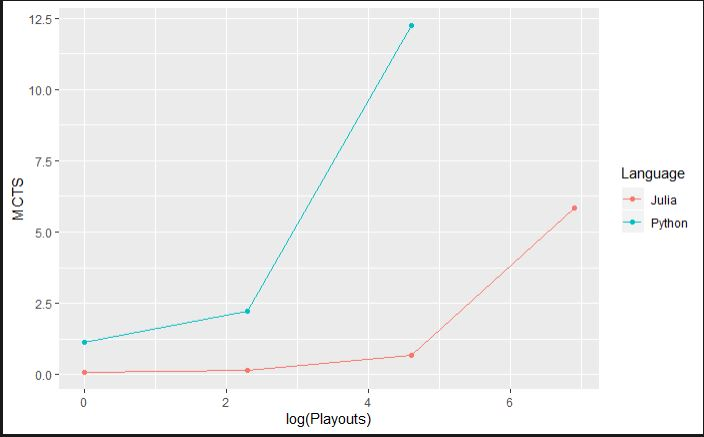

<!-- TABLE OF CONTENTS -->
## Table of Contents

* [Requirements](#requirements)
* [Chosen Project](#chosen-project)
* [Project Files](#project-files)
* [User Interface](#user-interface)
* [Python Library](#python-library)
  * [My Python Code](#my-python)
* [Chosen Language](#chosen-language)
  * [Speed Comparison](#speed-comparison)
* [Models](#models)
  * [Pure Monte-Carlo Tree Search](#pmcts)
  * [Monte-Carlo Tree Search With Tactics](#mcts-with-tactics)
  * [Alpha Beta Pruning](#alpha-beta)
  * [Heuristics](#heuristics)
  * [AI vs. AI comparison](#ai-vs-ai)

## Requirements

These can be found in `requirements.txt`
The code was built using Python 3.8.5 and Julia 1.5.0

Be sure you are running both 64 bit versions as Python tends to install 32 bit
by default and this will cause errors.

Set up venv:

`$python -m venv venv`

In Windows:

`$ venv\Scripts\activate.bat`

In Linux/MacOs:

`$ source venv/bin/activate`

Run:

``` 
$ pip install -r requirements.txt
$ juliaSetup.py
```


<!-- CHOSEN PROJECT -->
## Chosen Project

### Reversi with Monte-Carlo Tree Search

This is a program to play Reversi(Othello) against the computer. The AI player
uses variations on Monte-Carlo Tree Search(MCTS), with varying heuristics to
allow the player to play at different difficulty levels.

<!-- PROJECT FILES -->
## Project Files

* `reversi.py` : the Python Code to run the reversi game
* `juliaHelpers.jl` : julia AI functions called within the Pyhton script
* `environmentTest.py` : test script to be sure Julia environment is being
correctly called from python (see [My Python Code](#my-python) for more info)
* `test.py`
* `alphaBetajl.jl` : Julia alpha beta implementation
* `chooseMovejl.jl` : MCTS Julia implementation
* `dot.jl` : test code for Julia dot product
* `heuristics.jl` : heuristics implemented in Julia
* `requirements.txt` : code requirements
* `reversiAI.py` : AI vs AI in python
* `reversijl.py` : implementation in Julia
* `reversijlAI.py` : Julia implemented AI vs AI
* `test.py` : testing the dot products in python and Julia
* `MCTS.rmd` : R code for plotting
* `winTracker.*` : The raw data for the timing runs

<!-- USER INTERFACE -->
## User Interface
<p align="center">

</p>

To begin select the level of difficulty. To learn more about difficulty levels
see [Models](#models) 

The player is white, and will always go first.

The score is tallied in the bottom corners of the screen, black on the right and
white on the left.

The game will play until both players can no longer play a token and both need to
pass. The program will tell you that "The game is done!" and the final scores
can, again, be found at the bottom of the screen. The higher score is the winner!

You may play again by pressing the blue reverse arrow and close the screen by
pressing the red 'X'.

<p align="center">

</p>

<!-- PYTHON LIBRARY -->
## Python Library

The GUI for this code was forked from this git repository: 
https://github.com/johnafish/othello.git

### My Python

`PyJulia` has been used in order to interface the Julia environment though python.
For more info about the Julia language see [Chosen Language](#chosen-langauge).
In order to be sure that the code is correctly dropping to the Julia environment
rather than simply leveraging Julia code within the python environment a test
was run. Both the `@` and `dot()` method of matrix multiplication were
run within python, following a call to the Julia function `*`. All were timed.
As expected if we are correctly running within the Julia environment, the Julia
function has much smaller run times.

<p align="center">

</p>

My own modifications can be found in my repository under final_project:
https://csil-git1.cs.surrey.sfu.ca/ptuttosi/cmpt-310.git

Here are examples of the diff.

<p align="center">

</p>

I have also commented directly in the code with very clear hash marks where my
code is residing.

<p align="center">

</p>

<!-- CHOSEN LANGUAGE -->
## Chosen Language

I have chosen to write my "fast code" in Julia.

Julia is generally believed to be much faster than Python, and in some cases
faster an C or C++.

"\[Julia\] was designed and developed for speed, as the founders wanted
something ‘fast’. Julia is not interpreted...it is also compiled at Just-In-Time
or run time using the LLVM framework."

https://theiotmagazine.com/julia-vs-python-will-it-unseat-the-king-of-programming-8220e4cd2e0a

Other resources:

https://towardsdatascience.com/5-ways-julia-is-better-than-python-334cc66d64ae

https://www.infoworld.com/article/3241107/julia-vs-python-which-is-best-for-data-science.html

On top of this Julia is truly gaining a name for itself in the world of AI. The
community is thriving and as more and more people join to work on the code and
documentation we may one day soon see Julia surpass python, with its prominent
AI libraries such as jax, pytorch, and tensorflow, as "the" AI language.

https://www.geeksforgeeks.org/will-julia-become-the-empress-of-the-artificial-intelligence-world/?ref=leftbar-rightbar

### Speed Comparison

To validate the claims that Julia is, in fact, faster than Python, the program
was run in both languages and the average run times of each of the models was
recorded (for more on which models were tested see [Models](#models)).

This was done for 1, 10, 100, and 1000 playouts(or depth in the case of Alpha
Beta) and for each of the Models.
The comparison can be seen in the plots below. The average of 50 games was taken.

<p align="center">

</p>
<p align="center">

</p>
<p align="center">

</p>

These plots use a log time scale, but we can see that not only is Julia faster
than Python, but the speed decreases at a slower rate as the playouts increase.

We can see that for Pure Monte-Carlo Tree Search(PMCTS) Julia is able to make
approximately 170 playouts per second. Python on the other hand completes only
about 6. We see similar results for the other heuristics with Julia completing
about 165 playouts per second and Python completing close to 7 using MCTS with
tactics.

We could not even feasibly run more than 100 playouts for the MCTS variants in
Python. In Julia we could run 1000 in a reasonable time (about 5 seconds) and
we choose this time for the main program.

Alpha beta search is a bit of a different case. In python we could only run a
depth of 1, the jump to 10 made the run time much too long. In Julia we see that
We have a slightly faster play time at 1, but we are able to make up to 1000
plays with relative ease, although with much higher times than for MCTS. Our
curve, however, is a much different shape. We can see it very steeply increases
at 10 then flattens out. This is due to the nature of the algorithm being a tree
search using depth rather than playouts. The depth of the Tree is somewhere
close to 10, so increasing the depth past this point adds no new time as there is
no new area to search. We see such a steep increase with increased depth because
of the exponential nature of tree depth. We found that 5 depth took on average 
0.77 second per play, 7 depth took 3.18 and 8 depth took 18.54. In order to meet
our reasonable cut off of 5 seconds a depth of 7 was chosen for the main game.

In order to make efficient use of time these tests were done by running the AI
against itself. The outcomes of these games were used to monitor that the
"smarter AI" were, in fact, winning more games. For more on this see 
[AI vs. AI Comparison](#ai-vs-ai). 

<!-- MODELS -->
## Models

The models are written in both Python and Julia, however, the working
implementation uses Julia.

When selecting the difficulty to begin the game, you may select between 1 and 3
stars. These stars correspond to increasing intelligence in the level of the AI
opponent.

### PMCTS

One star implements the PMCTS through the function `chooseMove`. This algorithm
does *K* (`playouts`) random playouts for each of the valid moves as determined
by `getPlays` and `valid`. A random position is chosen, then this new board is
passed on to the function once more continuing until the game has come to an end
(`self.won == True`). The number of wins, losses and draws for each of the *K*
playouts is saved and a score is calculated as follows:

<a href="https://www.codecogs.com/eqnedit.php?latex=score&space;=&space;wins&space;&plus;&space;draws*2&space;-&space;losses*5" target="_blank"></a>

This score is stored in a dictionary with the index of the possible board as the
key. Once all of the playouts are complete the maximum of these scores is found
and this index becomes the chosen board.

### MCTS With Tactics

Two stars implement MCTS, again, through the function `chooseMove`. This
algorithm does *K* (`playouts`) playouts for each of the valid moves as 
determined by `getPlays` and `valid`. Rather than selecting a random play the
next play is determined by the maximum of the `finalHeuristic` score. More info
about the heuristic scores can be found in [Heuristics](#heuristics). Basically
this score is calculated based on known tactics, which increase the players
chances of winning a game of reversi.

The rest of the function continues in the same way as [PMCTS](#pmcts).

### Alpha Beta

The Alpha Beta pruning on a MiniMax tree is an extension of the MiniMax search
algorithm.

The MiniMax algorithm attempts to minimize the possible loss and maximize the
gain(ie. wins). MiniMax looks to find the highest value that that player can
achieve, without any knowledge of what actions the other player will take. In
a way this simultaneously forces the other player to receive the lowest value
possible.

Essentially, while traversing through a tree each level will represent
alternating players, with one player maximizing their value and the other
minimizing their opponent's value. The algorithm will always chose the move that
results in the best move for that player. The algorithm never wants to choose a
node that may result in a loss.

Once the entire tree is traversed the branch which results in the most likely
win scenarios, given both players maximizing their plays, is chosen as the next
move.

*Interesting Note* : Because, as we traverse the tree, each player is assumed to
be maximizing their chance of winning Non Zero Sum Games are at Nash Equilibrium
when MiniMax is followed.

MiniMax resources:

https://www.youtube.com/watch?v=l-hh51ncgDI

https://en.wikipedia.org/wiki/Minimax

Lecture Notes

Alpha Beta pruning helps the MiniMax algorithm be more efficient. The MiniMax
algorithm will tend to explore parts of the tree that it does not need to be
looking at. Min and Max bounds are used to limit which branches of the tree are
searched to avoid unnecessary computational time and power. 

Alpha is the best already explored option along the path to the root for the
maximizer, and Beta is the minimum already explored option along the path to the
root for the minimizer.

Alpha Beta resources:

https://www.youtube.com/watch?v=xBXHtz4Gbdo

http://en.wikipedia.org/wiki/Alpha%E2%80%93beta_pruning

https://www.geeksforgeeks.org/minimax-algorithm-in-game-theory-set-4-alpha-beta-pruning/

https://www.cs.cornell.edu/courses/cs312/2002sp/lectures/rec21.html

Lecture Notes

We start assuming the worst case for the maximizer (root) at -infinity for Alpha
and infinity for Beta.

Alpha and beta scores are calculated using the `finalHeuristic` (more on
heuristics in [Heuristics](#heuristics)). Alpha beta is recursively called in
order to traverse the tree while swapping between minimizing and maximizing.
When minimizing the new score value is compared to the current Beta value that
has been seen in the tree. If the current value is less than the saved Beta, the
branch will continue to be explored, however, if the value is larger than one we
have already seen we can prune this branch (beta<=alpha).

The same method is followed when maximizing Alpha.

### Heuristics

There are five score heuristics used in the program.

`simpleScore` : This simply tallies the number of resulting tiles of the
player's colour after they have made a given move against the number of tiles
held by the opponent.

`slightlyLessSimpleScore` : takes advantage of the most simple tactic by
weighting the player owning corner and edge pieces higher as they have strategic
advantages.

`decentHeuristic` : similarly takes advantage of the corner and edge strategy
but penalizes for the tiles next to corners, as these result in the loss of the
strategic corner locations

`earlyGame` : early on in the game, while they are still available, the player
wants to control the entry points to the corners in order to force the other
player into the spaces next to the corners. These are called the power pieces.
These positions are weighted the highest in this heuristic.

`finalHeuristic` : This is the heuristic used in both the MCTS with tactics and
the alpha beta pruning. This method takes into account the timing of the
strategies. For example, we begin by wanting to to control the power pieces, but
as these will likely soon be unavailable attention is shifted to the corners
while avoiding the positions next to corners. In the end as most positions are
taken the strategy becomes to simply control the most pieces on the board.

Reversi strategy resources:

http://samsoft.org.uk/reversi/strategy.html

https://guides.net4tv.com/games/how-win-reversi#:~:text=The%20basic%20moves%20of%20Reversi,your%20stone%20in%20that%20square

### AI vs AI

When completing the speed tests(see [Speed Comparison](#speed-comparison)) the
games were being played AI vs AI. We not only want to know comparisons of speed
between the methods, we also would like to see an improved performance as new
heuristics are added.

When playing the PMCTS against MCTS with tactics, the tactics won every time, no
matter the depth. When playing Alpha Beta against the PMCTS the PMCTS won most
often when the depth at 1. This makes sense as we will not be
searching very deep into the tree yet the random playouts will still play out an
entire game. Similarly when playing MCTS with Tactics with the Alpha Beta we
needed to have more than a depth of 10 to see the Alpha Beta winning more often.

As soon as we increase the depth at all we see Alpha Beta dominating the play.

In order to run these tests you much change : `playouts` to the number of
playouts to run and change `depth` to be 4 for MCTS, 1 for PMCTS and 6 for Alpha
Beta